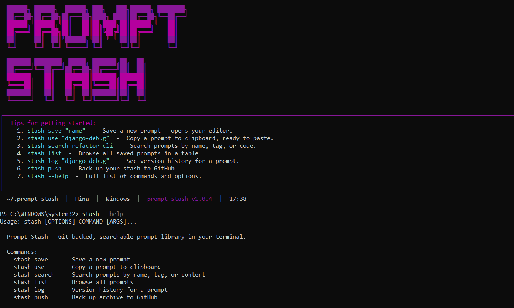

# Prompt Stash

**Prompt Stash** is a terminal-based, version-controlled prompt manager designed for AI power users. Save, version-control, search, and quickly copy prompt templates right from your terminal.

 

## Features

- **Store & Retrieve**: Save prompts as Markdown with YAML frontmatter. Retrieve them instantly to your clipboard using fuzzy search.
- **Version Control**: Every save, rename, or deletion automatically triggers a Git commit behind the scenes using `GitPython`.
- **Searchable**: Search for prompts by name, content, or tag via a SQLite Full-Text Search index.
- **GitHub Sync**: Instantly push and pull your stash to a remote GitHub repository.
- **Beautiful UI**: Enjoy a rich, interactive terminal experience powered by `click` and `rich`.

---

## Installation 

The best way to install Prompt Stash and guarantee that the `stash` command is available in your terminal is by using [`pipx`](https://pipx.pypa.io/stable/).

### Option 1: Using pipx (Recommended)
```bash
# If you don't have pipx, install it first: pip install pipx
pipx install prompt-stash
```

### Option 2: Using pip
```bash
pip install prompt-stash
```
> **Note**: If you use `pip`, the `stash` command might show up as `"command not found"` if your Python `Scripts` directory is not in your system's `PATH`. If that happens, either add the Scripts folder to your PATH, or use `pipx`.

---

## Getting Started

Save your first prompt. This will automatically set up your stash in `~/.promptvault/` and open your default system editor.

```bash
stash save "code-reviewer"
```

### Copying Prompts

When you need to use a prompt, just copy it to your clipboard:

```bash
stash use "code-reviewer"
```

If you don't remember the exact name, you can search for it:

```bash
stash search refactor
```

### All Commands

```bash
stash save [NAME]       # Save or edit a prompt
stash use [NAME]        # Copy content to clipboard
stash list              # Browse all saved prompts
stash search [QUERY]    # Search by name, tags, or content
stash log [NAME]        # See the Git version history for a prompt
stash diff [NAME]       # Compare versions
stash rollback [NAME]   # Revert a prompt to an older version
stash push              # Back up your stash to GitHub
stash pull              # Pull your stash from GitHub
```

## Storage & Configuration

- **Data**: All your prompts are saved in `~/.promptvault/prompts/` as standard Markdown files.
- **Metadata**: A fast SQLite search index is maintained at `~/.promptvault/vault.db`.
- **Config**: Edit `~/.promptvault/config.toml` to change your default GitHub repository or editor settings.

## License

This project is licensed under the MIT License.
